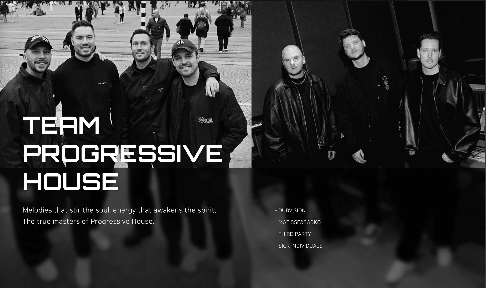

# 🎵 Progressive House Project


This project is a **Vue 3 + TypeScript + Vite** based web application.  
It was created as a **personal project** dedicated to **Progressive House** 🎶.

---

## 🌍 Link

🔗 https://www.djthirdparty.com/prog/

---

## 🚀 Tech Stack

- ⚡ **Vue 3 (Composition API + `<script setup>`)**
- 🔷 **TypeScript**
- ⚙️ **Vite**
- 🎨 **SCSS**
- 🌐 **Responsive & Mobile-friendly design**

---

## 📸 Preview



---

## 🛠️ Project Setup

```sh
npm install

Compile and Hot-Reload for Development

npm run dev

Type-Check, Compile and Minify for Production

npm run build

Lint with ESLint

npm run lint


```
